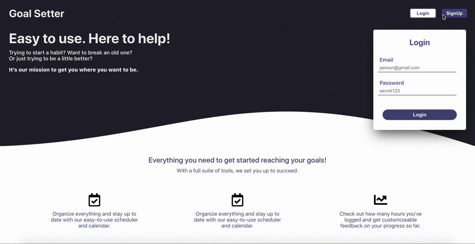

### Current Progress
This project was a playground for my first attempt at using Redux. Though currently the design (of both the UI and logic) are far from complete, I'm happy with the progress I've made, and am excited to clean up my code and get to a better spot. 

In the next month, I plan to refactor the application into TypeScript with a more simplified design as I continue reading The Pragmatic Programmer, The Clean Coder, Clean Code, Design Patterns: Elements of Reusable Object-Oriented Software, etc. and working to better my understanding of Redux, React, and each libraries best-practices. 

The application itself currenlty allows users to login, create goals and subtasks that make up those goals, and update and track their progress. Currenlty, the home page and landing page are complete, while the dashboard and calendar pages are still works in progress. 

Below, you can find a video with the current functionality as well as a list of the technology used for the project. 

### Demo

(Apologies for the speed and quality, this is the best I could get for a free converter.)

### Technology Used
<ul>
  <li>React</li>
  <li>Redux</li>
  <li>Java</li>
  <li>Spring MVC</li>
  <li>MySQL</li>
</ul>
